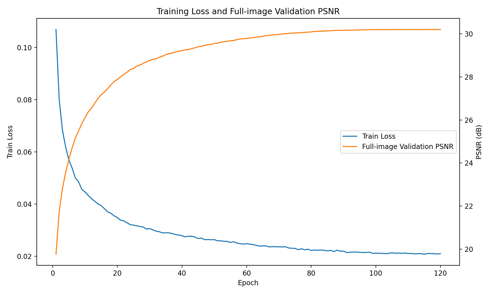
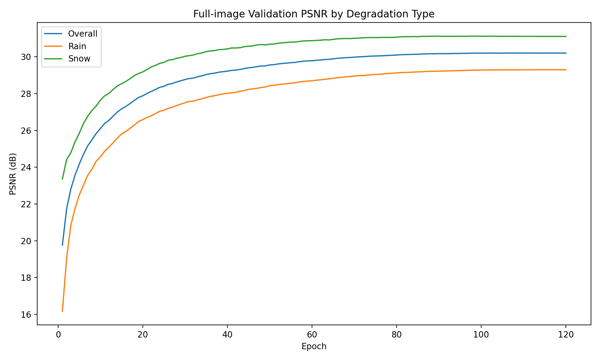
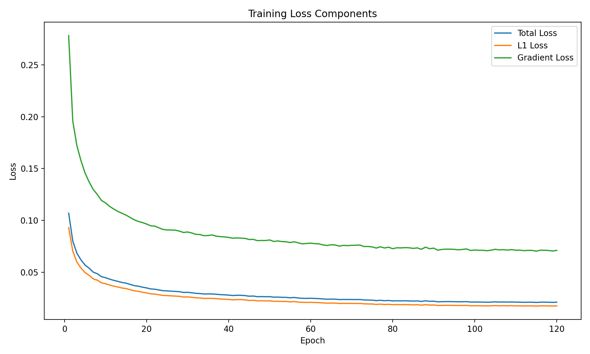
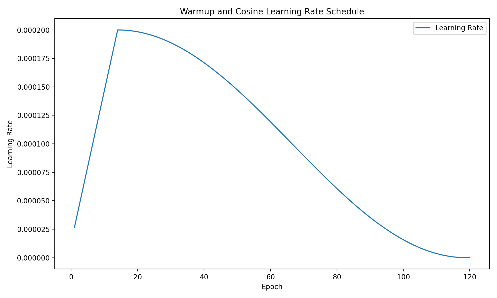
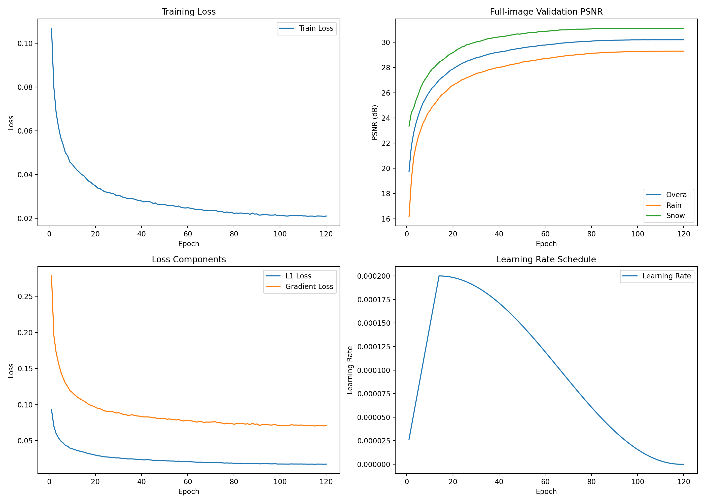
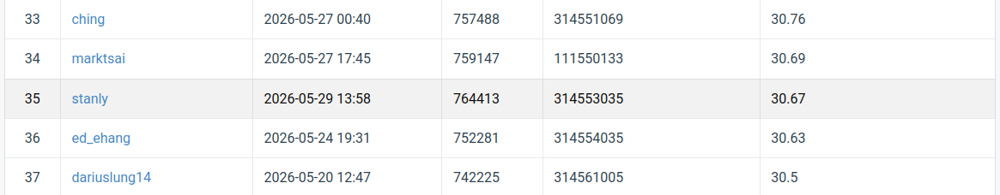

# NYCU Computer Vision 2026 - Homework 4

Image Restoration for Rain and Snow Degradation with a PromptIR-inspired Network

Name: Cheng-Yu Cheng  
Student ID: 314553035  
GitHub Repository: https://github.com/stanlybaa/NYCU-Computer-Vision-2026-HW4

## 1. Introduction

The objective of this assignment is to solve an image restoration task. Given a degraded image containing either rain or snow corruption, the model must restore the corresponding clean image.

The assignment requires training a single model that can handle both rain and snow degradation. No external data and no pretrained weights are allowed. Therefore, all model weights in this repository are trained from scratch using only the provided paired degraded-clean training images.

The final method is based on a PromptIR-inspired restoration network. PromptIR uses learnable prompts to adapt restoration features for different degradation patterns. In this implementation, I build a prompt-based encoder-decoder network from scratch and train it jointly on rain and snow images.

## 2. Repository Structure

NYCU-Computer-Vision-2026-HW4/
- README.md
- requirements.txt
- .gitignore
- dataset.py
- model.py
- train.py
- inference.py
- plot_metrics.py
- figures/
  - training_curve.png
  - validation_psnr_by_type.png
  - loss_components.png
  - learning_rate_schedule.png
  - training_summary_4panel.png
  - leaderboard.png

## 3. Dataset

The expected dataset structure is:

release_folder/
- hw4_realse_dataset/
  - train/
    - degraded/
      - rain-1.png
      - ...
      - rain-1600.png
      - snow-1.png
      - ...
      - snow-1600.png
    - clean/
      - rain_clean-1.png
      - ...
      - rain_clean-1600.png
      - snow_clean-1.png
      - ...
      - snow_clean-1600.png
  - test/
    - degraded/
      - 0.png
      - ...
      - 99.png

The training set contains paired degraded and clean images. The degraded images are divided into two types: rain and snow. The test set only provides degraded images with numerical filenames, so the model must restore all test images using a single unified restoration model.

## 4. Method

## 4.1 Baseline Attempts

At the beginning of the assignment, I implemented a small PromptIR-style baseline model with an encoder-decoder structure and lightweight prompt generation blocks. This baseline was able to learn both rain and snow restoration, but its full-image validation PSNR saturated at a relatively low value.

I also tested degradation-aware classification guidance, where an auxiliary classifier predicted whether the input image was rain or snow. Although the classifier quickly reached high accuracy, the restoration PSNR did not improve significantly. This suggested that the main bottleneck was restoration capacity and training stability, not degradation recognition.

## 4.2 Final Model: PromptIR-inspired Restoration Network

The final model is a PromptIR-inspired image restoration network trained from scratch. The model follows an encoder-decoder structure and predicts a residual image. The final restored image is obtained by adding the predicted residual to the degraded input image.

The network contains the following major components:

- Multi-DConv transposed attention blocks
- Gated depthwise-convolution feed-forward networks
- Learnable prompt generation blocks
- Encoder-decoder skip connections
- Residual image prediction

The prompt generation block learns a set of prompt tensors. For each input feature map, the model predicts a soft weighting over the prompt tensors and combines them into an adaptive prompt. The generated prompt is then fused with the restoration feature. This design follows the key idea of PromptIR: using prompts to help a single model adapt to different degradation patterns.

## 4.3 Full-image Validation

An important issue in this task is that center-crop validation can be misleading. A model may achieve high PSNR on the center crop but perform worse on the whole image. Therefore, the final training pipeline uses full-image tiled validation.

During validation, each validation image is restored using tiled inference, and PSNR is computed on the entire image. The best checkpoint is selected according to full-image validation PSNR instead of center-crop PSNR.

## 5. Loss Function

The final objective combines pixel reconstruction loss and gradient consistency loss.

Total loss:

L = L1(pred, target) + lambda_grad * L_grad(pred, target)

where lambda_grad is set to 0.05.

The L1 loss encourages pixel-level accuracy, while the gradient loss helps preserve image structures and edges. This is useful for rain and snow restoration because degradation artifacts often appear as streaks, edges, or high-frequency patterns.

## 6. Hyperparameters

## 6.1 Dataset Split

Train / validation split:
- Rain images 1 to 1500: training
- Rain images 1501 to 1600: validation
- Snow images 1 to 1500: training
- Snow images 1501 to 1600: validation

Number of training image pairs: 3000  
Number of validation image pairs: 200

## 6.2 Model Hyperparameters

Architecture: PromptIR-inspired restoration network  
Base dimension: 48  
Input channels: 3  
Output channels: 3  
Prompt type: learnable prompt tensors  
Prediction type: residual image prediction  
Training initialization: from scratch  
Pretrained weights: not used  
External data: not used

## 6.3 Training Hyperparameters

Epochs: 120  
Warmup epochs: 15  
Batch size: 2  
Patch size: 256  
Steps per epoch: 2152  
Optimizer: AdamW  
Learning rate: 2e-4  
Weight decay: 1e-4  
Gradient loss weight: 0.05  
Scheduler: linear warmup followed by cosine decay  
EMA decay: 0.999  
Mixed precision: enabled  
Validation method: full-image tiled validation  
Tile size: 256  
Tile overlap: 64  
Best checkpoint metric: full-image validation PSNR

## 6.4 Inference Hyperparameters

Inference method: tiled inference  
Tile size: 256  
Tile overlap: 64  
EMA weights: used  
Output file: pred.npz  
Submission archive: submission.zip

## 7. Environment Setup

Create the environment:

conda create -n hw4 python=3.10 -y
conda activate hw4

Install dependencies:

pip install -r requirements.txt

The main packages are:

- torch
- torchvision
- numpy
- pillow
- matplotlib
- tqdm

## 8. Usage

## 8.1 Training

Run training with full-image validation:

python train.py \
  --data_root ./release_folder/hw4_realse_dataset \
  --save_dir ./hw4_checkpoints_promptir_l1grad_single_b2_d48 \
  --epochs 120 \
  --warmup_epochs 15 \
  --batch_size 2 \
  --patch_size 256 \
  --steps_per_epoch 2152 \
  --dim 48 \
  --lr 2e-4 \
  --weight_decay 1e-4 \
  --grad_weight 0.05 \
  --tile_size 256 \
  --overlap 64 \
  --use_ema \
  --ema_decay 0.999 \
  --num_workers 4

The best checkpoint is saved as:

hw4_checkpoints_promptir_l1grad_single_b2_d48/best_fullval_promptir.pth

## 8.2 Inference

Generate the CodaBench submission file:

python inference.py \
  --data_root ./release_folder/hw4_realse_dataset \
  --checkpoint ./hw4_checkpoints_promptir_l1grad_single_b2_d48/best_fullval_promptir.pth \
  --output_npz ./pred.npz \
  --output_zip ./submission.zip \
  --dim 48 \
  --tile_size 256 \
  --overlap 64 \
  --use_ema

The generated submission file is:

submission.zip

The zip file contains:

pred.npz

## 9. Results

The final model achieved a public CodaBench PSNR above the strong baseline.

Public leaderboard score:

30.67

Since this homework is an image restoration task evaluated by PSNR, a confusion matrix is not applicable. Instead, I report full-image validation PSNR, rain/snow validation PSNR, loss curves, and the public leaderboard result.

## 9.1 Training Curve

The following figure shows the training loss and full-image validation PSNR.

## 9.2 Validation PSNR by Degradation Type

The following figure compares the full-image validation PSNR for rain and snow images.

## 9.3 Loss Components

The following figure shows the total training loss, L1 loss, and gradient loss.

## 9.4 Learning Rate Schedule

The following figure shows the linear warmup and cosine learning rate decay schedule.

## 9.5 Training Summary

The following figure summarizes the main training curves.

## 9.6 Public Leaderboard

The following figure shows the public CodaBench leaderboard result.

## 10. Discussion

The final result shows that full-image validation is much more reliable than center-crop validation for this task. Early experiments using center-crop validation produced overly optimistic validation PSNR, while the public leaderboard score was significantly lower. After switching to full-image tiled validation, the validation score became much more consistent with the public leaderboard score.

The rain subset was generally more difficult than the snow subset because rain streaks are thin, directional, and often spread over the whole image. The gradient loss helped preserve image structure and improved restoration quality for such high-frequency degradation patterns.

The final model uses only the provided training data and is trained from scratch. No external data or pretrained weights are used.

## 11. References

- PromptIR: Prompting for All-in-One Image Restoration.
- PyTorch documentation.
